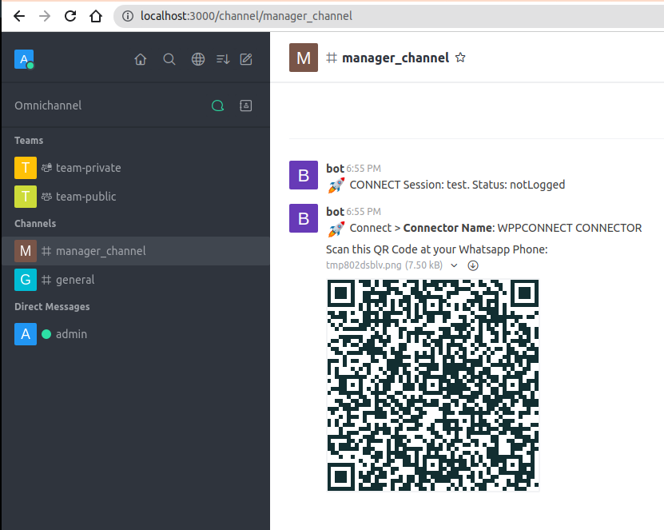
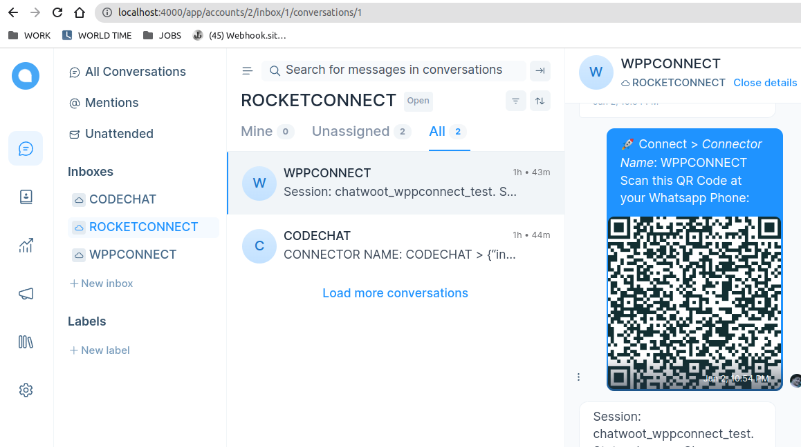
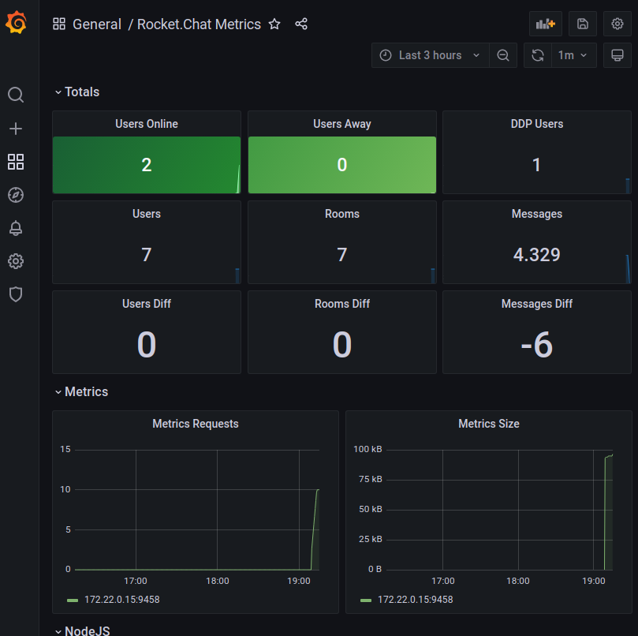
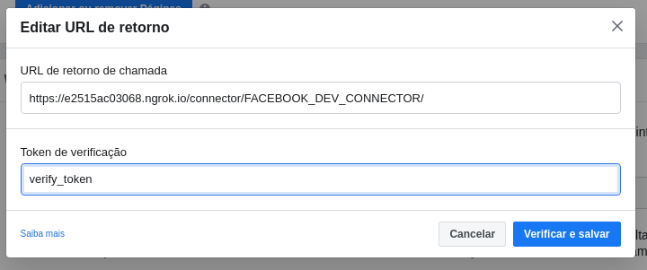
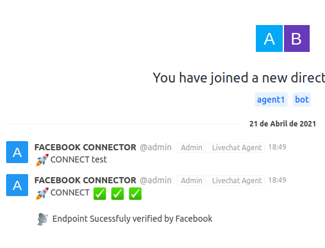

How To
======================================================================

Run the development stack
----------------------------------------------------------------------

To run the development stack, you must haver docker and docker compose properly installed. 

For convenience, RocketChat and ChatWoot are on separte files now.
    ::
    
        docker compose -f local.yml -f rocketchat-compose.yml -f chatwoot-compose.yml up -d

Now you should wait a little bit. check the logs to see whats happening:
    ::
    
        docker compose -f local.yml logs -f

We have created a nice management command to setup everything for you.

    ::
    
        docker compose -f local.yml run --rm django python manage.py dev_settings

Also, if playing with Chatwoot, you need to run:

    ::

        docker compose -f chatwoot-compose.yml run --rm rails bundle exec rails db:chatwoot_prepare

You can `check what this command does <https://github.com/dudanogueira/rocket.connect/blob/master/rocket_connect/instance/management/commands/dev_settings.py>`_ to replicate it while deploying in production

If everything went fine, you should have the following running services and exposed ports:

* http://localhost:8000 - Rocket Connect Admin User/Password: admin/admin
* http://localhost:3000 - Rocket Chat Server. User/Password: adminrc/admin or agent1/agent1 or manager1/manager1

* http://localhost:4000 - ChatWoot Server. User/Password: register a new one and then get your token at the Super Admin console. You will need it later on as your ApiKey. This ApiKey you will update as Secret Token to the Chatwoot server

* http://localhost:80 - Livechat Widget Demo. A simple website with livechat installed.
* http://localhost:5555 - Flower, where you see how the tasks are running. User/Password: admin/admin
* http://localhost:8025 - Mailhog - A nice mailserver. The stack is configured to deliver emails there
* http://localhost:21465/api-docs/ - WPPCONNECT API DOCS

Generating and Scanning the QR CODE in ROCKET.CHAT
----------------------------------------------------------------------

Go to Rocket.Connect (http://localhost:8000) login in (admin/admin), pick de default registered server, then go the Connector page.
click at Initialize. Wait a little bit, and then click at get status.
You should see the QR code at the correspnding chat platform.

At the end, you should see the QR CODE, that should be scanned with the device you want to PAIR.

Generating and Scanning the QR CODE in ChatWoot

The same goes to chatwoot. After initializing its connectors, you should get one Inbox for ROCKETCONNECT itself, where there will be conversations for each connector,
and an inbox per connector, where the incoming conversations and messages will be created:

Active Chat (for Rocket.Chat)
----------------------------------------------------------------------
WPPCONNECT Connector comes with active chat. 

It means that at if you go to http://localhost:3000/channel/manager_channel and type: 

    ::

        zapit 5531999851111@department-name Hello World!

You wil be able to open a room, transfer to the selected department and then send a message to the user.

It will try to find a Department that has department-name. If not found, it will try to look for an online agent with that name. 

Which means that
    ::

        zapit 5531999851111@agent1 Hello World!

will also work.

Monitoring with Grafana (REMOVED)
----------------------------------------------------------------------

Emulating an incoming message
----------------------------------------------------------------------
    ::
    
        c = Connector.objects.get(external_token="WPP_EXTERNAL_TOKEN")
        ConnectorClass = c.get_connector_class()
        payload = {"payload": "here"}
        connector = ConnectorClass(c, json.dumps(payload), "incoming")

get a message connector class initialized

    ::

        message_id = 1234
        m = Message.objects.get(pk=message_id)
        connector = m.get_connector()

Resetting the dev environment
----------------------------------------------------------------------
Run:
docker compose -f local.yml -f chatwoot-compose.yml -f rocketchat-compose-yml down -v

Configuring Facebook Messenger
----------------------------------------------------------------------

By default, the dev_settings will set up a facebook endpoint for you with the verify_token set as, well, "verify_token". You will need to set up Facebook Messenger APP to this endpoint, and set up the verification token as... verify_token. You can run a ngrok to help do that. Like this:

    ::
    
        ngrok http 8000

You will get a temporarily hostname, that points to it. My case here:

https://e2515ac03068.ngrok.io

you setup like that at your facebook messenger configuration

If everything went fine, will receive a message like this at Rocket.Chat

you will also need to generate a token, in order to send back messages and get more informations about the visitor.after getting this token, change the connector conigurations at: http://127.0.0.1:8000/admin/instance/connector/

you need to change the "generate this" with the token facebook will give you.

.. figure:: facebook_connector_config.png

After that messages to your facebook account should be connected to RocketChat. If something goes wrong, facebook will stop sending messages for a while. That's normal. 

Supported Connectors
----------------------------------------------------------------------

`WPPCONNECT <https://wppconnect.io/>`_ 

`CODECHAT <https://github.com/code-chat-br/whatsapp-api>`_ 

META CLOUD API (SPONSORED)
----------------------------------------------------------------------

`SPONSORS NEEDED <https://github.com/sponsors/dudanogueira/>`_
We plan on supporting the official Meta Cloud API for WhatsApp.

INSTAGRAM (SPONSORS NEEDED)
----------------------------------------------------------------------

`SPONSORS NEEDED <https://github.com/sponsors/dudanogueira/>`_
We plan on supporting the official Meta Cloud API for Instagram.