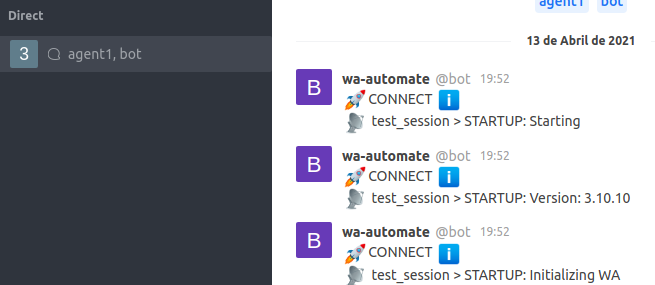

How To
======================================================================

Run the development stack
----------------------------------------------------------------------

To run the development stack, you must haver docker and docker compose properly installed. You should run
    ::
    
        docker-compose -f local.yml up -d

We have created a nice management command to setup everything for you:

    ::
    
        docker-compose -f local.yml run --rm django python manage.py dev_settings

If everything went fine, you should have the following running services and exposed ports:

* http://localhost:8000/admin - Rocket Connect Admin User/Password: admin/admin
* http://localhost:3000 - Rocket Chat Server. User/Password: admin/admin
* http://localhost:5555 - Flower, where you see how the tasks are running. User/Password: admin/admin
* http://localhost:8025 - Mailhog - A nice mailserver
* http://localhost:3010 - BrowserLess - A Browserless chrome instance
* http://localhost:8002/api-docs/ - WA-AUTOMATE API DOCS - Only Available after QR SCANNING

Scanning WA-AUTOMATE QR CODE
----------------------------------------------------------------------

If you access Rocket Chat, as admin, you should see new direct messages popping with the launch status of the WA-AUTOMATE CLient.

At the end, you should see the QR CODE, that should be scanned with the device you want to PAIR.

Inside RocketChat
----------------------------------------------------------------------

To receive medias, its necessary to change the URL inside RocketChat.

Go to:
Administration -> General -> Site URL and put your IP address or valid URL.

